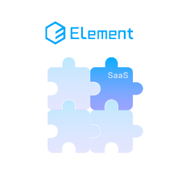

# Element SaaS 扩展
[](https://www.npmjs.com/package/element-ui-saas-extend)&nbsp;[](https://www.jsdelivr.com/package/npm/element-ui-saas-extend)

由于近期工作主要偏向 SaaS 业务开发，在表单和表格的交互上的开发有很高重复性，为减少重复工作量，决定整理个针对SaaS业务的预设组件库。项目在 Element UI 套件的基础上开发，就作为他的扩展组件库吧。

## 文档

- [扩展文档 - Gitee](https://kwokronny.gitee.io/element-ui-saas-extend/)
- [扩展文档 - Github](https://kwokronny.github.io/element-ui-saas-extend/)

## 特性
- ### 效率至上
	整理常见业务下的重复性工作，汇合成预设组件，高效的完成工作。
- ### 尽享自由
  尽可能的梳理耦合，在兼顾高效的同时，亦给予自由的空间自定义垂直业务下的特殊场景。
- ### 简单易用
  沿用Element UI 的标准开发，尽可能多的示例代码与文档，帮助你快速上手。

## 安装

### npm 安装

```shell
yarn add element-ui-saas-extend -S
# or
npm install element-ui-saas-extend -S
```

```js static
import Vue from "vue";
import ElementUI from "element-ui";
import "element-ui/lib/theme-chalk/index.css";
Vue.use(ElementUI);

import ElementUISaaSExtend from "element-ui-saas-extend";
import "element-ui-saas-extend/lib/theme-chalk/index.css";
Vue.use(ElementUISaaSExtend);
```

### CDN 引入

```html
<link rel="stylesheet" href="https://unpkg.com/element-ui/lib/theme-chalk/index.css" />
<link rel="stylesheet" href="https://unpkg.com/element-ui-saas-extend/lib/theme-chalk/index.css" />

<script src="//unpkg.com/vue"></script>
<script src="//unpkg.com/element-ui"></script>
<script src="//unpkg.com/element-ui-saas-extend"></script>
```

更多内容请查看[文档](#文档)

# TODO
- [] 编写测试用例
- [] 支持国际化

# 支持作者🚀

[作者博客](https://kwokronny.top/)

如果您正在使用这个项目并感觉良好，或者是想支持我继续开发，Star 并分享这个项目

欢迎大家为该项目提交自己的建议 及 `Issus`，当然也欢迎大家提交 `push request`

